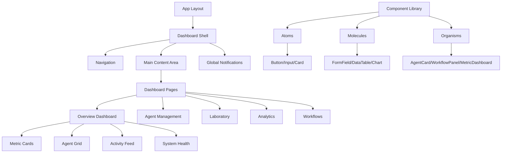
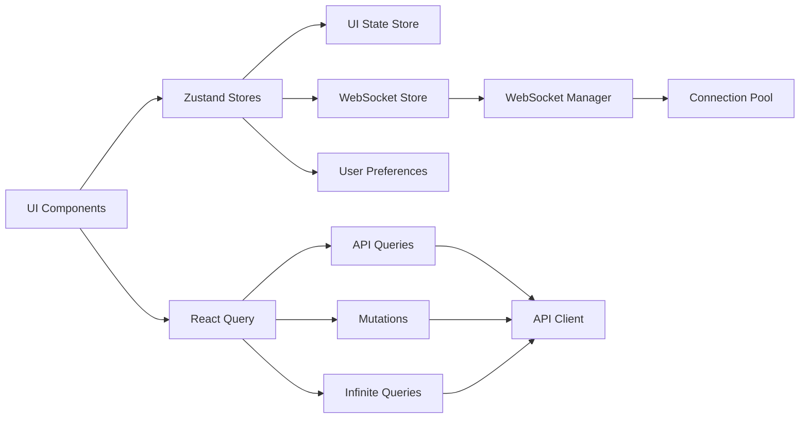

# BioThings UI Dashboard Architecture Plan

## Executive Summary

This document outlines a comprehensive architectural plan for overhauling the BioThings UI dashboard. The plan addresses current technical debt, consolidates duplicate components, introduces modern state management, and establishes a foundation for scalable growth.

## Current State Analysis

### Technology Stack
- **Framework**: Next.js 13+ with App Router
- **UI Library**: React 18+ with TypeScript
- **Styling**: Tailwind CSS with dark mode support
- **Charts**: ECharts for data visualization
- **State Management**: React Query for server state, no global client state solution
- **Real-time**: Custom WebSocket implementation with multiple overlapping approaches
- **Dependencies**: Zustand installed but unused, socket.io-client present

### Key Issues
1. **Component Duplication**: Three versions of AgentOverview component
2. **WebSocket Fragmentation**: Multiple WebSocket implementations without clear separation
3. **State Management Gap**: No global state management for complex UI state
4. **Performance Concerns**: No virtualization for large lists, unoptimized re-renders
5. **Type Safety**: Inconsistent type definitions across components
6. **Code Organization**: Mixed concerns in components (data fetching, UI, business logic)

## 1. Component Architecture

### Design Principles
- **Single Responsibility**: Each component has one clear purpose
- **Composition over Inheritance**: Build complex UIs from simple, reusable components
- **Separation of Concerns**: Separate UI, business logic, and data fetching
- **Type Safety First**: Full TypeScript coverage with strict mode

### Component Hierarchy



### Component Library Structure

```
components/
├── ui/                    # Reusable UI components (atoms)
│   ├── button/
│   ├── card/
│   ├── input/
│   ├── modal/
│   └── tooltip/
├── data-display/         # Data visualization components
│   ├── charts/
│   ├── tables/
│   └── metrics/
├── forms/                # Form components
│   ├── fields/
│   └── validation/
├── layout/               # Layout components
│   ├── navigation/
│   ├── sidebar/
│   └── header/
└── features/             # Feature-specific components
    ├── agents/
    ├── workflows/
    ├── laboratory/
    └── analytics/
```

### Component Design System

```typescript
// Example of standardized component interface
interface ComponentProps {
  className?: string;
  children?: React.ReactNode;
  loading?: boolean;
  error?: Error | null;
  testId?: string;
}

// Standardized component template
export const Component: FC<ComponentProps> = memo(({
  className,
  children,
  loading = false,
  error = null,
  testId
}) => {
  // Component implementation
});
```

## 2. State Management Strategy

### Architecture Overview



### Zustand Store Structure

```typescript
// stores/index.ts
import { create } from 'zustand';
import { devtools, persist } from 'zustand/middleware';

// UI State Store
interface UIState {
  theme: 'light' | 'dark' | 'auto';
  sidebarCollapsed: boolean;
  dashboardLayout: DashboardLayout;
  activeFilters: FilterState;
  setTheme: (theme: UIState['theme']) => void;
  toggleSidebar: () => void;
  updateLayout: (layout: DashboardLayout) => void;
  updateFilters: (filters: Partial<FilterState>) => void;
}

export const useUIStore = create<UIState>()(
  devtools(
    persist(
      (set) => ({
        theme: 'auto',
        sidebarCollapsed: false,
        dashboardLayout: defaultLayout,
        activeFilters: {},
        setTheme: (theme) => set({ theme }),
        toggleSidebar: () => set((state) => ({ 
          sidebarCollapsed: !state.sidebarCollapsed 
        })),
        updateLayout: (layout) => set({ dashboardLayout: layout }),
        updateFilters: (filters) => set((state) => ({ 
          activeFilters: { ...state.activeFilters, ...filters } 
        })),
      }),
      { name: 'ui-store' }
    )
  )
);

// WebSocket State Store
interface WebSocketState {
  connections: Map<string, ConnectionInfo>;
  subscriptions: Map<string, Subscription[]>;
  globalStatus: 'connected' | 'connecting' | 'disconnected';
  subscribe: (topic: string, handler: MessageHandler) => () => void;
  unsubscribe: (topic: string, handler: MessageHandler) => void;
  send: (topic: string, data: any) => void;
  getConnectionStatus: (topic: string) => ConnectionStatus;
}

export const useWebSocketStore = create<WebSocketState>()(
  devtools((set, get) => ({
    connections: new Map(),
    subscriptions: new Map(),
    globalStatus: 'disconnected',
    subscribe: (topic, handler) => {
      // Implementation
      return () => get().unsubscribe(topic, handler);
    },
    unsubscribe: (topic, handler) => {
      // Implementation
    },
    send: (topic, data) => {
      // Implementation
    },
    getConnectionStatus: (topic) => {
      // Implementation
    },
  }))
);

// Agent State Store
interface AgentState {
  agents: Map<string, Agent>;
  selectedAgent: string | null;
  agentMetrics: Map<string, AgentMetrics>;
  updateAgent: (agent: Agent) => void;
  selectAgent: (agentId: string | null) => void;
  updateMetrics: (agentId: string, metrics: AgentMetrics) => void;
}

export const useAgentStore = create<AgentState>()(
  devtools((set) => ({
    agents: new Map(),
    selectedAgent: null,
    agentMetrics: new Map(),
    updateAgent: (agent) => set((state) => {
      const agents = new Map(state.agents);
      agents.set(agent.id, agent);
      return { agents };
    }),
    selectAgent: (agentId) => set({ selectedAgent: agentId }),
    updateMetrics: (agentId, metrics) => set((state) => {
      const agentMetrics = new Map(state.agentMetrics);
      agentMetrics.set(agentId, metrics);
      return { agentMetrics };
    }),
  }))
);
```

### React Query Integration

```typescript
// hooks/queries/useAgents.ts
export const useAgents = () => {
  const updateAgent = useAgentStore((state) => state.updateAgent);
  
  return useQuery({
    queryKey: ['agents'],
    queryFn: apiClient.getAgents,
    onSuccess: (agents) => {
      agents.forEach(agent => updateAgent(agent));
    },
    staleTime: 5 * 60 * 1000, // 5 minutes
    cacheTime: 10 * 60 * 1000, // 10 minutes
  });
};

// Real-time sync with WebSocket
export const useAgentSync = () => {
  const updateAgent = useAgentStore((state) => state.updateAgent);
  const queryClient = useQueryClient();
  
  useWebSocketSubscription('agent-updates', (update) => {
    // Update Zustand store
    updateAgent(update.agent);
    
    // Update React Query cache
    queryClient.setQueryData(['agents'], (old: Agent[]) => {
      return old?.map(a => a.id === update.agent.id ? update.agent : a);
    });
  });
};
```

## 3. Performance Optimization Plan

### Virtual Scrolling Implementation

```typescript
// components/ui/virtual-list/VirtualList.tsx
import { VirtualItem, useVirtualizer } from '@tanstack/react-virtual';

interface VirtualListProps<T> {
  items: T[];
  height: number;
  itemHeight: number | ((index: number) => number);
  renderItem: (item: T, virtualItem: VirtualItem) => ReactNode;
  overscan?: number;
  estimateSize?: (index: number) => number;
  getItemKey?: (index: number) => string;
}

export function VirtualList<T>({ ... }: VirtualListProps<T>) {
  // Optimized virtual list implementation
}
```

### Chart Optimization Strategy

```typescript
// hooks/useOptimizedChart.ts
export const useOptimizedChart = (data: ChartData[], options: ChartOptions) => {
  // Debounce data updates
  const debouncedData = useDebounce(data, 300);
  
  // Memoize chart config
  const chartConfig = useMemo(() => {
    return {
      ...defaultConfig,
      ...options,
      animation: {
        duration: data.length > 1000 ? 0 : 300, // Disable animation for large datasets
      },
      progressive: data.length > 5000 ? 500 : undefined, // Progressive rendering
      progressiveThreshold: 5000,
    };
  }, [debouncedData, options]);
  
  // Use ResizeObserver for responsive charts
  const { ref, dimensions } = useResizeObserver();
  
  return { chartConfig, dimensions, ref };
};
```

### Code Splitting Strategy

```typescript
// app/routes.tsx
const routes = [
  {
    path: '/',
    component: lazy(() => import('./dashboard/page')),
    preload: () => import('./dashboard/page'),
  },
  {
    path: '/agents',
    component: lazy(() => import('./agents/page')),
    preload: () => import('./agents/page'),
  },
  {
    path: '/laboratory',
    component: lazy(() => import('./laboratory/page')),
    preload: () => import('./laboratory/page'),
  },
  // Route-based code splitting
];

// Preload on hover
export const RouteLink = ({ to, children, ...props }) => {
  const route = routes.find(r => r.path === to);
  
  return (
    <Link 
      to={to} 
      onMouseEnter={() => route?.preload?.()} 
      {...props}
    >
      {children}
    </Link>
  );
};
```

### Caching Strategy

```typescript
// lib/cache/CacheManager.ts
class CacheManager {
  private memoryCache = new Map<string, CacheEntry>();
  private indexedDB: IDBDatabase | null = null;
  
  async get<T>(key: string): Promise<T | null> {
    // Check memory cache first
    const memEntry = this.memoryCache.get(key);
    if (memEntry && !this.isExpired(memEntry)) {
      return memEntry.data;
    }
    
    // Check IndexedDB for larger data
    if (this.indexedDB) {
      const dbEntry = await this.getFromIndexedDB(key);
      if (dbEntry && !this.isExpired(dbEntry)) {
        // Promote to memory cache
        this.memoryCache.set(key, dbEntry);
        return dbEntry.data;
      }
    }
    
    return null;
  }
  
  async set<T>(key: string, data: T, ttl: number = 5 * 60 * 1000) {
    const entry: CacheEntry = {
      data,
      timestamp: Date.now(),
      ttl,
    };
    
    // Store in memory
    this.memoryCache.set(key, entry);
    
    // Store large data in IndexedDB
    if (this.shouldStoreInIndexedDB(data)) {
      await this.setInIndexedDB(key, entry);
    }
  }
}
```

## 4. UI/UX Design Principles

### Design System Guidelines

```scss
// styles/design-tokens.scss
:root {
  // Colors
  --color-primary: #0066cc;
  --color-secondary: #6c757d;
  --color-success: #28a745;
  --color-warning: #ffc107;
  --color-danger: #dc3545;
  
  // Spacing
  --space-xs: 0.25rem;
  --space-sm: 0.5rem;
  --space-md: 1rem;
  --space-lg: 1.5rem;
  --space-xl: 2rem;
  
  // Typography
  --font-sans: system-ui, -apple-system, sans-serif;
  --font-mono: 'SF Mono', Monaco, monospace;
  
  // Shadows
  --shadow-sm: 0 1px 2px rgba(0, 0, 0, 0.05);
  --shadow-md: 0 4px 6px rgba(0, 0, 0, 0.07);
  --shadow-lg: 0 10px 15px rgba(0, 0, 0, 0.1);
  
  // Animation
  --duration-fast: 150ms;
  --duration-normal: 300ms;
  --duration-slow: 500ms;
  --easing-default: cubic-bezier(0.4, 0, 0.2, 1);
}

// Dark mode
[data-theme="dark"] {
  --color-primary: #4da6ff;
  --color-background: #1a1a1a;
  --color-surface: #2d2d2d;
  --color-text: #ffffff;
}
```

### Accessibility Standards

```typescript
// components/ui/button/Button.tsx
interface ButtonProps extends React.ButtonHTMLAttributes<HTMLButtonElement> {
  variant?: 'primary' | 'secondary' | 'danger';
  size?: 'sm' | 'md' | 'lg';
  loading?: boolean;
  icon?: ReactNode;
  ariaLabel?: string;
}

export const Button = forwardRef<HTMLButtonElement, ButtonProps>(
  ({ loading, disabled, ariaLabel, children, ...props }, ref) => {
    return (
      <button
        ref={ref}
        disabled={disabled || loading}
        aria-label={ariaLabel}
        aria-busy={loading}
        aria-disabled={disabled || loading}
        {...props}
      >
        {loading && <Spinner aria-hidden="true" />}
        {children}
      </button>
    );
  }
);
```

### Responsive Design Approach

```typescript
// hooks/useResponsive.ts
export const useResponsive = () => {
  const [breakpoint, setBreakpoint] = useState(getBreakpoint());
  
  useEffect(() => {
    const handleResize = debounce(() => {
      setBreakpoint(getBreakpoint());
    }, 150);
    
    window.addEventListener('resize', handleResize);
    return () => window.removeEventListener('resize', handleResize);
  }, []);
  
  return {
    isMobile: breakpoint === 'sm',
    isTablet: breakpoint === 'md',
    isDesktop: breakpoint === 'lg' || breakpoint === 'xl',
    breakpoint,
  };
};

// Responsive component example
export const DashboardGrid = ({ children }) => {
  const { isMobile } = useResponsive();
  
  return (
    <div className={cn(
      'grid gap-6',
      isMobile ? 'grid-cols-1' : 'grid-cols-2 lg:grid-cols-3'
    )}>
      {children}
    </div>
  );
};
```

### Animation and Interaction Patterns

```typescript
// lib/animations.ts
export const animations = {
  fadeIn: {
    initial: { opacity: 0 },
    animate: { opacity: 1 },
    exit: { opacity: 0 },
  },
  slideUp: {
    initial: { opacity: 0, y: 20 },
    animate: { opacity: 1, y: 0 },
    exit: { opacity: 0, y: -20 },
  },
  scale: {
    initial: { scale: 0.9, opacity: 0 },
    animate: { scale: 1, opacity: 1 },
    exit: { scale: 0.9, opacity: 0 },
  },
};

// Micro-interactions
export const useHoverEffect = () => {
  const [isHovered, setIsHovered] = useState(false);
  
  return {
    isHovered,
    hoverProps: {
      onMouseEnter: () => setIsHovered(true),
      onMouseLeave: () => setIsHovered(false),
    },
  };
};
```

## 5. Technical Implementation Roadmap

### Phase 1: Core Infrastructure (Weeks 1-2)

#### 1.1 State Management Setup
- [ ] Implement Zustand stores for UI, WebSocket, and domain state
- [ ] Create store devtools integration
- [ ] Set up persistence middleware for user preferences
- [ ] Create typed hooks for store access

#### 1.2 Unified WebSocket Provider
- [ ] Consolidate WebSocket implementations
- [ ] Create WebSocketProvider component
- [ ] Implement connection pooling
- [ ] Add automatic reconnection with exponential backoff
- [ ] Create typed subscription system

#### 1.3 API Client Consolidation
- [ ] Merge all API client implementations
- [ ] Implement request deduplication
- [ ] Add proper caching with ETags
- [ ] Create batch request support
- [ ] Add request/response interceptors

### Phase 2: Component Library Development (Weeks 3-4)

#### 2.1 Design System Foundation
- [ ] Create design tokens (colors, spacing, typography)
- [ ] Build base UI components (Button, Input, Card, Modal)
- [ ] Implement consistent theming system
- [ ] Add Storybook for component documentation

#### 2.2 Data Display Components
- [ ] Create reusable Table component with sorting/filtering
- [ ] Build Chart wrapper components for ECharts
- [ ] Implement VirtualList for large datasets
- [ ] Create MetricCard and StatCard components

#### 2.3 Layout Components
- [ ] Build responsive Navigation component
- [ ] Create flexible Layout system
- [ ] Implement Sidebar with collapse functionality
- [ ] Add breadcrumb navigation

### Phase 3: Dashboard UI Implementation (Weeks 5-6)

#### 3.1 Dashboard Consolidation
- [ ] Remove duplicate AgentOverview components
- [ ] Create unified AgentCard component
- [ ] Implement responsive dashboard grid
- [ ] Add drag-and-drop for dashboard customization

#### 3.2 Real-time Features
- [ ] Implement live data updates via WebSocket
- [ ] Create real-time notification system
- [ ] Add activity feed with virtual scrolling
- [ ] Implement presence indicators

#### 3.3 Performance Optimizations
- [ ] Add React.memo to all components
- [ ] Implement virtual scrolling for lists
- [ ] Add progressive chart rendering
- [ ] Optimize bundle size with dynamic imports

### Phase 4: New Feature Additions (Weeks 7-8)

#### 4.1 Advanced Filtering and Search
```typescript
interface FilterSystem {
  // Global search with fuzzy matching
  globalSearch: string;
  
  // Field-specific filters
  filters: {
    agents: AgentFilter[];
    workflows: WorkflowFilter[];
    experiments: ExperimentFilter[];
  };
  
  // Saved filter presets
  savedFilters: FilterPreset[];
  
  // Quick filters
  quickFilters: QuickFilter[];
}
```

#### 4.2 Customizable Dashboard Layouts
```typescript
interface DashboardLayout {
  id: string;
  name: string;
  widgets: Widget[];
  gridConfig: GridConfig;
  isDefault: boolean;
  isShared: boolean;
}

interface Widget {
  id: string;
  type: WidgetType;
  position: GridPosition;
  config: WidgetConfig;
  dataSource: DataSource;
}
```

#### 4.3 Export/Import Functionality
- [ ] Export dashboard configurations
- [ ] Export data in multiple formats (CSV, JSON, PDF)
- [ ] Import dashboard layouts
- [ ] Share dashboard snapshots

#### 4.4 Enhanced Data Visualization
- [ ] Add new chart types (Sankey, Heatmap, Treemap)
- [ ] Implement interactive chart features
- [ ] Create data comparison views
- [ ] Add time-series analysis tools

#### 4.5 User Preferences and Settings
```typescript
interface UserPreferences {
  theme: 'light' | 'dark' | 'auto';
  language: string;
  timezone: string;
  notifications: NotificationPreferences;
  dashboard: DashboardPreferences;
  accessibility: AccessibilitySettings;
}
```

### Phase 5: Performance Optimization and Cleanup (Week 9)

#### 5.1 Performance Audit
- [ ] Run Lighthouse audits
- [ ] Profile React components
- [ ] Optimize bundle size
- [ ] Implement performance monitoring

#### 5.2 Code Cleanup
- [ ] Remove all duplicate components
- [ ] Consolidate similar utilities
- [ ] Update all imports to use barrel exports
- [ ] Add comprehensive error boundaries

#### 5.3 Testing Infrastructure
- [ ] Add unit tests for utilities
- [ ] Create integration tests for API
- [ ] Add E2E tests for critical paths
- [ ] Implement visual regression testing

## 6. New Features Detailed Specifications

### 6.1 Advanced Filtering and Search

```typescript
// components/features/search/AdvancedSearch.tsx
interface AdvancedSearchProps {
  onSearch: (query: SearchQuery) => void;
  searchableFields: SearchField[];
  enableFuzzySearch?: boolean;
  enableRegexSearch?: boolean;
}

interface SearchQuery {
  text: string;
  fields: string[];
  filters: Filter[];
  dateRange?: DateRange;
  sortBy?: SortConfig;
  fuzzy?: boolean;
  regex?: boolean;
}

// Features:
// - Full-text search across all entities
// - Field-specific filtering
// - Date range selection
// - Saved search queries
// - Search history
// - Export search results
```

### 6.2 Customizable Dashboard Layouts

```typescript
// components/features/dashboard/DashboardBuilder.tsx
interface DashboardBuilderProps {
  widgets: WidgetDefinition[];
  layout: DashboardLayout;
  onSave: (layout: DashboardLayout) => void;
  onPreview: (layout: DashboardLayout) => void;
}

// Features:
// - Drag-and-drop widget placement
// - Resizable widgets
// - Widget configuration panels
// - Layout templates
// - Responsive breakpoints
// - Undo/redo functionality
```

### 6.3 Export/Import Functionality

```typescript
// services/export/ExportService.ts
class ExportService {
  async exportDashboard(
    dashboardId: string,
    format: ExportFormat,
    options: ExportOptions
  ): Promise<Blob> {
    // Implementation
  }
  
  async exportData(
    dataType: DataType,
    filters: Filter[],
    format: ExportFormat,
    options: ExportOptions
  ): Promise<Blob> {
    // Implementation
  }
  
  async importDashboard(
    file: File,
    options: ImportOptions
  ): Promise<DashboardLayout> {
    // Implementation
  }
}

// Supported formats:
// - JSON (full fidelity)
// - CSV (tabular data)
// - PDF (reports with charts)
// - PNG (dashboard screenshots)
```

### 6.4 Enhanced Data Visualization Options

```typescript
// components/features/visualization/VisualizationBuilder.tsx
interface VisualizationBuilderProps {
  data: DataSet;
  chartTypes: ChartType[];
  onSave: (visualization: Visualization) => void;
}

// New visualization types:
// - Sankey diagrams for workflow visualization
// - Heatmaps for correlation analysis
// - Network graphs for agent relationships
// - Time-series with anomaly detection
// - 3D scatter plots for multivariate analysis
// - Gantt charts for experiment timelines
```

### 6.5 User Preferences and Settings

```typescript
// components/features/settings/UserSettings.tsx
interface UserSettingsProps {
  user: User;
  preferences: UserPreferences;
  onSave: (preferences: UserPreferences) => void;
}

// Settings categories:
// - Appearance (theme, density, animations)
// - Notifications (email, in-app, push)
// - Data (default filters, refresh rates)
// - Privacy (data retention, sharing)
// - Accessibility (contrast, font size, motion)
// - Integrations (external services)
```

## Migration Strategy

### Step 1: Parallel Development
- Keep existing components functional
- Build new components alongside old ones
- Use feature flags for gradual rollout

### Step 2: Incremental Migration
```typescript
// Feature flag system
const features = {
  newDashboard: process.env.NEXT_PUBLIC_NEW_DASHBOARD === 'true',
  advancedSearch: process.env.NEXT_PUBLIC_ADVANCED_SEARCH === 'true',
  // ...
};

// Usage
export default function DashboardPage() {
  return features.newDashboard ? <NewDashboard /> : <LegacyDashboard />;
}
```

### Step 3: Data Migration
- Export existing user preferences
- Transform to new schema
- Import with validation
- Provide rollback mechanism

### Step 4: Cleanup
- Remove legacy components
- Update documentation
- Archive old code
- Update CI/CD pipelines

## Success Metrics

### Performance Metrics
- Initial load time < 2s
- Time to interactive < 3s
- Frame rate > 60fps during animations
- Memory usage < 100MB baseline
- WebSocket latency < 100ms

### User Experience Metrics
- Task completion time reduced by 30%
- Error rate reduced by 50%
- User satisfaction score > 4.5/5
- Feature adoption rate > 80%
- Support ticket reduction by 40%

### Technical Metrics
- Code coverage > 80%
- Bundle size < 500KB (gzipped)
- Lighthouse score > 90
- Zero critical vulnerabilities
- Build time < 2 minutes

## Risk Mitigation

### Technical Risks
1. **WebSocket Connection Issues**
   - Mitigation: Implement fallback to polling
   - Add connection health monitoring
   - Create offline mode support

2. **Performance Degradation**
   - Mitigation: Continuous performance monitoring
   - Implement performance budgets
   - Add automated performance tests

3. **State Synchronization Issues**
   - Mitigation: Implement conflict resolution
   - Add optimistic updates with rollback
   - Create state snapshot system

### Organizational Risks
1. **User Adoption**
   - Mitigation: Phased rollout with beta testing
   - Comprehensive user training
   - In-app guidance and tooltips

2. **Development Timeline**
   - Mitigation: Agile development with MVPs
   - Regular stakeholder check-ins
   - Flexible scope management

## Conclusion

This architectural plan provides a comprehensive roadmap for modernizing the BioThings UI dashboard. By following this plan, we will:

1. Eliminate technical debt through component consolidation
2. Improve performance with optimized rendering and caching
3. Enhance user experience with modern UI patterns
4. Enable rapid feature development with a solid foundation
5. Ensure long-term maintainability with proper architecture

The phased approach allows for incremental improvements while maintaining system stability. Each phase builds upon the previous one, creating a robust and scalable dashboard solution.